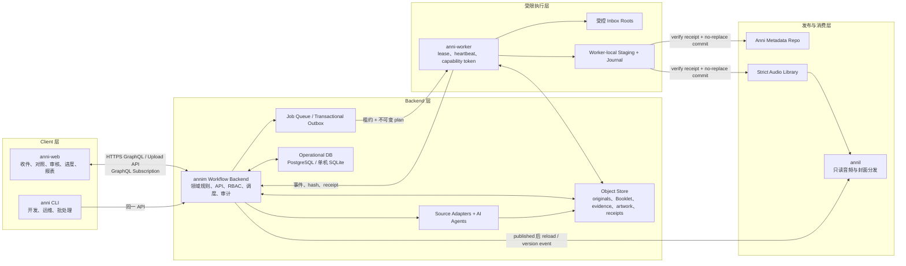
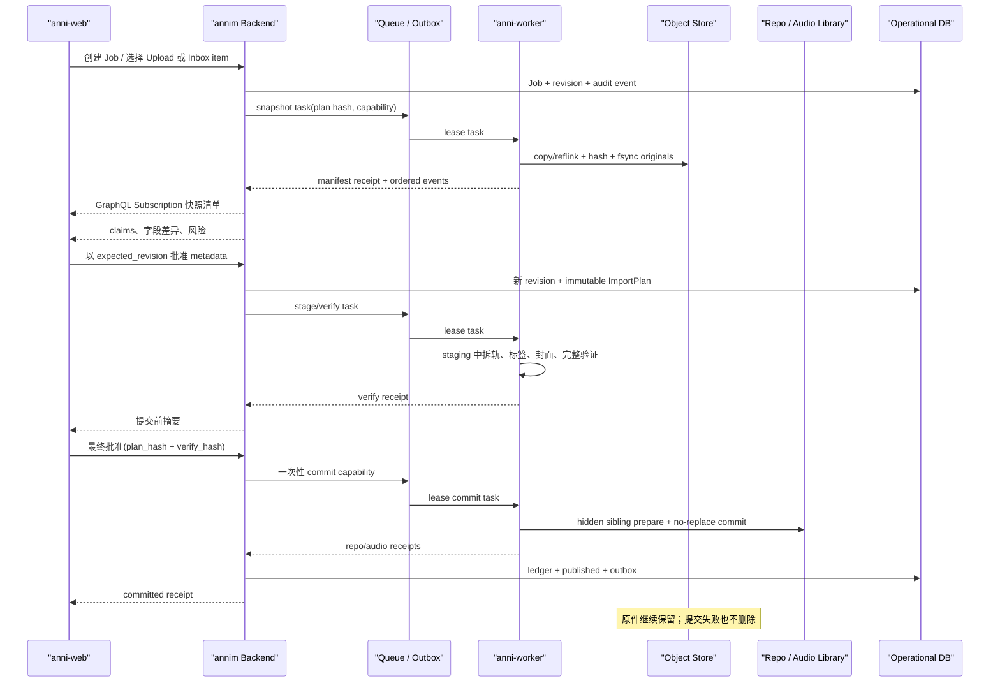

# Anni 音频整理 Web 系统与安全入库 Workflow 设计

> 状态：Draft
>
> 设计基线：2026-07-11 当前工作区代码
>
> 适用范围：以 CD 抓轨为主、流媒体文件为辅的个人或协作式音乐收藏整理

## 1. 文档目标

本文设计一套围绕“音频入库时得到完整、准确、可追溯元数据”的端到端工作流。终态产品不是一组需要整理人员手工串联的 CLI，而是一套 **Web Client + Backend + Worker** 的 server-client 系统：整理人员在浏览器中完成收件、资料对照、审核、封面选择、进度查看和最终批准；Backend 作为工作流与数据真值；Worker 在受限权限下执行快照、拆轨、标签、验证与提交。

文档既描述整理人员在 Web 中看到的操作步骤，也落到 Anni 当前代码能够复用的模块、必须先修复的风险，以及需要新增的前端、服务端、Worker、数据结构和协议边界。CLI 仅作为开发、运维和批处理入口，不构成另一套业务流程。

这套体系的核心不是“让 AI 自动改文件”，而是把四件事连接起来：

1. 建立艺人发行目录，知道应该收集什么、还缺什么。
2. 保存原始音频、CUE、Booklet 与网络资料，并把它们视为证据。
3. 由 Agent 提取和比较候选信息，经规则与人工审核后形成正式元数据。
4. 由 Backend 调度受限 Worker，在不损害原文件的前提下拆轨、写标签、验证、提交并实时回写进度。

本文不讨论绕过 DRM、未经授权获取音频或自动发布到公共网络。工作流只处理用户已经合法获得并明确交给系统管理的文件。

## 2. 最重要的设计结论

### 2.1 八条不可妥协的原则

1. **原始文件不可变。** 原始 WAV、CUE、Booklet、抓轨日志和原始封面一经接收，只允许读取和复制，不允许原地写标签、改名或删除。
2. **外部数据先是观察值，不是真值。** VGMDB、Apple Music、MusicBrainz、CUE 和搜索结果只能生成候选；任何网络结果都不能直接覆盖正式元数据。
3. **CD 实物证据优先，Booklet 优先解释文字。** 对 CD 版本，曲名、署名和 credits 以 Booklet 为最高优先级；品番、条码、发售日等应结合 OBI、背卡、盘面和发行商资料按字段判断。
4. **忠于原文，同时沿用已验证的字符规范。** 标题、署名、括号、大小写和有意义的空格应贴近来源；中点统一为 `・`、波浪线统一为 `～`，这是 Anni 经过实践确定的 canonicalization，不视为元数据冲突。原始 OCR/网页/CUE 字符串仍保留在证据中。
5. **Agent 只提议，确定性执行器才操作文件。** Agent 输出结构化候选、差异和 `ImportPlan`；文件复制、拆轨、转码、写标签、提交只能由受限执行器按已审核计划完成。
6. **表格是视图，不是真值库。** Artist 维度的“已收集/未收集”表由 collection ledger 生成；人工可以在审核界面修改状态，但不能靠手工维护一份会漂移的独立表格。
7. **Backend 是业务真值。** Job、ledger、evidence、审核决定、同步状态和 receipt 的权威版本由 Backend 保存；Web Client 与 CLI 都只能通过同一 API 修改，不得直写数据库或仓库。
8. **浏览器无文件系统能力，Worker 按能力令牌执行。** Web Client 不接收任意服务端路径或存储密钥；Worker 只执行 Backend 签发的、绑定 Job、动作、输入清单、有效期和 plan hash 的任务。

### 2.2 三类信息必须分开

| 类别 | 回答的问题 | 示例 | 正式存放位置 |
| --- | --- | --- | --- |
| 发行元数据 | 这张发行物和每条音轨是什么 | 曲名、艺人、品番、日期、credits、类型 | Backend metadata revision；发布时确定性投影到 `anni-metadata` / Git Repo |
| 收藏副本信息 | 我们实际拿到了哪一份文件 | PT/BT、天使动漫、群友、CD 自抓、采样率、位深、哈希 | Backend collection ledger |
| 证据与决策 | 为什么最终这样填写 | Booklet 第 8 页、官网 URL、候选冲突、审核人 | Backend evidence/decision records + Object Store |

“网播/CD/群友分享”是来源或介质，不能当作音乐类型；“普通歌曲/纯音乐/伴奏”是音轨语义，不能从文件来源推断。

## 3. 当前项目基线与差距

### 3.1 可以复用的能力

| 领域 | 现有模块 | 可复用能力 | 当前边界 |
| --- | --- | --- | --- |
| 正式元数据模型 | `anni-metadata/src/model/album.rs` | `Album → Disc → Track`、artist/type 继承、扁平 `role → 原文 artist string` credits、TOML 序列化、`deny_unknown_fields` | 无人物 ID、顺序/join phrase、来源、证据、收藏副本和显式 Unknown；credits 在其他持久化/写回路径会丢失 |
| 音乐类型 | `TrackType` | `normal / instrumental / absolute / drama / radio / vocal` | 标题猜测只覆盖伴奏、Drama、Radio，不能作为最终分类器 |
| 元数据仓库 | `anni-repo` | 按品番存储 TOML、加载、格式化、部分 lint、SQLite 物化 | 写入不事务化；SQLite 往返会丢失 `artists` |
| CUE 解析与拆轨 | `anni-split::{cue_breakpoints, split}` | CUE `INDEX 01` 转断点、WAV 拆分、FLAC 外部编码器 | 缺少完整 WAV/CUE 校验、事务输出、退出码检查和真实自动化测试 |
| FLAC 读写 | `anni-flac` | STREAMINFO、Vorbis Comment、Picture 读取与写入 | 当前保存可能原地覆盖；备份很短暂；没有 fsync、结果校验和恢复日志 |
| 工作目录 | `anni-workspace` | AlbumID 严格目录、用户区/受控区、状态扫描、专辑锁概念 | 当前 commit/publish 非事务，不能直接充当安全入库执行器 |
| 标签写入 | `anni-repo/src/models/album.rs` | 将正式 Album 投影到 FLAC 标签并嵌入封面 | 会清空 Comment 后只写少数字段；默认非 detailed 路径还会移除图片 |
| 外部候选 | `anni repo get`、当前使用的外部 `anni-vgmdb` 依赖 | VGMDB、CUE、MusicBrainz 的初步导入 | 无 Booklet/Apple/官网；无逐字段出处；部分路径会直接写仓库 |
| Workflow Backend 基础 | `annim` | Axum、Async-GraphQL、GraphQL WebSocket、SeaORM migrations、SQLite/PostgreSQL feature、鉴权 guard 与搜索索引 | 当前只覆盖正式 Album/Disc/Track/Tag；Subscription 为空；缺 Job、Artist、ledger、evidence、RBAC、对象存储和 Worker 调度 |
| 音频分发 | `anni-provider`、`annil` | 从本地或 Drive 提供已入库音频和 `cover.jpg` | 这是存储读取层，不是外部资料搜集层 |
| 粗粒度审核状态 | `annim::MetadataOrganizeLevel` | `Initial / Partial / Reviewed / Finished` | 只描述 Album 元数据成熟度，不描述收藏进度或字段级审核 |
| Web Client / Worker | 无 | 无 | 需要新增 `anni-web` 与 `anni-worker`；仓库当前没有可承载完整整理流程的 Web 前端，也没有可租约执行文件任务的常驻 Worker |

### 3.2 当前约定、差距与边界

#### 忠于原文与既有字符规范

- `anni-common/src/validator.rs` 已将多种中点统一为 `・`，并将 `〜` 统一为 `～`；`repo lint` 默认执行这些检查。这两条规则是经过实践确认的最佳解法，应作为正式 canonicalization 基线保留，而不是列为缺陷。
- `full_title()` 固定使用 `【edition】` 生成完整标题；固定拼接格式不一定等于发行物实际呈现，需要区分“结构化 title/edition”与“展示投影”。
- 目录名反向解析无法恢复因文件系统限制而被替换的 `/`，因此文件名仍不能成为正式标题的反向真值来源。

系统必须拆分四种文本，并且只让一种进入正式元数据：

- `source_raw`：证据中的原始 OCR、网页、CUE 字符串及原始字节引用，保持来源可审计；
- `canonical_text`：审核值经过版本化规则处理后的正式文本；当前明确包含“中点 → `・`、波浪线 → `～`”，同时保留其他有意义的括号、大小写与空格；
- `search_text`：仅用于检索的 NFKC/case-fold 等宽松派生值；
- `filesystem_safe_name`：仅用于路径的派生值。

`source_raw` 与 `canonical_text` 不同并不自动表示错误。只有不属于批准 canonicalization 的变化，才进入字符差异审核。

#### 元数据完整性

当前正式模型缺少或无法无损往返的内容包括：

- label、barcode/UPC、ISRC、介质、外部 ID；
- Booklet 页码、扫描区域、来源 URL、抓取时间、审核人、冲突记录；
- 逐曲 composer、lyricist、arranger、vocal、演奏者等 credits 的无损持久化；
- 音质、获取渠道、抓轨日志、原文件哈希；
- 未知值及“为什么未知”。

当前三层 `artists: HashMap<String, String>` 是正式的详细 credits 结构，可表达 `vocal/composer/lyricist/arranger` 和任意乐器角色；但它没有结构化人物 ID、顺序/join phrase、关系来源，且当前 TOML → SQLite、TOML ↔ Annim、Annim GraphQL 创建/更新和 FLAC 写回都不是无损通道。它目前是整张 map 级继承而非逐 role 合并，新 schema 必须明确继承策略。

当前 `AnniDate` 对年、年月精度的实现还会产生 `YYYY-00-00` 或 `YYYY-MM-00`，且不验证真实日历范围。日期模型必须重做精度表示和完整/模糊日期 round-trip，不能只修改显示层。

#### 当前外部资料导入

- VGMDB 搜索会默认取第一个结果，适合召回候选，不适合自动确认身份。
- `repo get cue` 先以 VGMDB 结果为主体，再用 CUE 覆盖少量 performer；数量不一致时使用 `zip()` 会静默截断。
- 当前 MusicBrainz 路径只处理人工指定的单个 Release，使用前还需要修正 URL 构造并增加契约测试。
- 没有 Apple Music、Amazon、发行商官网、艺人官网、Cover Art Archive 或 Booklet 适配器。

#### 当前已入库资源 Provider

- Annil 当前用 `HashMap` 保存配置 backend，再迭代构造 `MultipleProviders`，顺序不稳定。
- `MultipleProviders::get_cover` 在第一个“拥有该 Album”的 provider 缺封面或报错时会直接返回，不会尝试后续 provider。
- `PriorityProvider` 虽有逐个尝试语义，但生产 wiring 没有用它。

因此，“最高画质封面”和稳定 fallback 不能建立在现有 provider 组合上。未来应使用确定顺序的 backend list 和 per-resource fallback；这仍只负责已入库资源分发，不参与外部 artwork 候选排名。

#### Annim 当前边界

- `annim/src/main.rs` 已经是 Axum + Async-GraphQL 服务，并提供 GraphQL WebSocket 入口；因此终态 Backend 应在 `annim` 上演进，而不是另起一套与正式元数据割裂的服务。
- Server 可按 Tag/OrganizeLevel 列 Album，但 keyword 分支仍未实现；Rust client 的列表接口主要按 UUID 获取。
- 当前没有 Artist、inventory、sync-run 或 CSV/XLSX exporter。
- 当前 schema 使用 `EmptySubscription`，WebSocket 入口尚不能提供 Job 进度事件；CORS 为全开放，鉴权也不足以表达整理者、审核者、操作员等角色。
- `Finished` 不是强不可变状态，仍可能被降级或修改；本文所说的“收紧”属于后续建设，而非当前保证。

### 3.3 自动化前必须阻断的安全问题

以下不是一般优化，而是启用 Agent 自动入库之前必须修复的 P0：

1. `workspace init` 在参数缺失或冲突时会调用 `workspace.destroy()`；当前 `destroy()` 删除的是整个 workspace root，而不仅是刚创建的 `.anni`。
2. `workspace add --dry-run` 和 `--yes` 当前未被 handler 使用；所谓 dry-run 仍会执行 commit 和移动音频。
3. FLAC 外部编码器等待子进程后不检查退出状态；`anni split` 却默认在流程返回成功后删除或送入废纸篓原始音频与 CUE。
4. `fs::move_dir` 会吞掉除跨盘错误以外的 `rename` 失败；publish 随后仍可能删除用户目录。
5. Workspace commit 是逐文件 `rename → symlink`，没有 journal 或整体回滚；进程中断会留下半提交状态。
6. `apply_strict` 和 `FlacHeader::save` 会修改实际 FLAC；当前默认 publish 还可能只保留编号标签并移除内嵌封面。
7. Repo TOML 直接写最终路径，没有临时文件、no-replace 原子提交和跨资源事务。

在这些问题修复前，AI Agent 不得直接调用 `workspace init/add/publish/rm/fsck --gc`、`library link` 或默认 `anni split`。

## 4. 目标体系总览



这张图表达三个关键边界：所有人工决策从 Web 进入；所有权威状态由 Backend 保存；所有接触真实音频文件的能力集中在 Worker。Backend 不挂载用户音频库，Web 也不能把任意绝对路径交给服务器执行。

### 4.1 终态组件边界

| 组件 | 终态职责 | 对现有项目的落点 |
| --- | --- | --- |
| `anni-web` | 唯一主要交互面；Artist 目录、Inbox、Booklet/OCR 对照、字段审核、TrackType、封面候选、Job 进度、提交确认和报表 | 新建 Web 应用；仓库当前没有前端工程 |
| `annim` Workflow Backend | Workflow、ledger、evidence、metadata revision、RBAC、审核、同步、Job 调度、审计与事件流的业务真值 | 复用现有 Axum + Async-GraphQL + SeaORM + SQLite/PostgreSQL 基础，扩展 schema、migration、REST 上传接口与真正的 GraphQL Subscription；SSE 仅作兼容事件入口 |
| `anni-worker` | 领取租约任务；在受控 Inbox/Object Store 与 staging 间复制；调用拆轨、标签、验证和事务提交；上报 receipt | 新建常驻 Rust binary；复用 `anni-split`、`anni-flac`、`anni-workspace`、`anni-repo`，但先修复 P0 风险 |
| `anni-ingest` | 与 UI、HTTP、Agent SDK 无关的领域模型、安全计划、reconcile、验证和 Saga 库 | 新建 Rust library，由 `annim` 与 `anni-worker` 共用；不能自己成为另一套本地应用 |
| Operational DB | 保存 Job、claim、decision、revision、ledger、worker、sync run、audit event、outbox | 单机版可使用 Annim 的 SQLite feature；NAS/协作版使用 PostgreSQL；两者保持同一 API 和 migration 语义 |
| Object Store | 保存 originals、Booklet、网页快照、原始封面、执行产物和 receipt；内容按 hash 寻址 | 新建抽象；单机可为受控本地目录，服务化部署可为 S3-compatible storage |
| Anni Repo / Audio Library / `annil` | Repo 和音频库是发布目标；`annil` 只消费 `published` 版本并提供只读音频与封面 | 保持现有分发边界；不得把审核、入库或 Worker 调度塞进 `annil` |
| `anni` CLI | 调用同一 Backend API、运行 migration/诊断、管理 Worker；紧急期保留 legacy 命令 | 降级为兼容客户端；不能保留一套与 Web 不同的字段决策或文件流程 |

正常编辑的写入口只有 Backend。Git Repo 仍保留版本审阅、生态兼容与发布价值，但变成已批准 metadata revision 的确定性投影；若外部人员直接修改 TOML，必须通过“Repo import → diff → review → 新 Backend revision”回流，不能与 Web 形成双主写入。

### 4.2 一次请求如何闭环

1. 整理人员在 Web 新建 Ingest Job，并选择浏览器上传或某个已注册 Worker 的 Inbox item。
2. Backend 先建立 Job、metadata revision 和幂等键；Browser upload 通过受控分片会话直接进入 Object Store，Worker Inbox 则只使用 Backend 已登记的 opaque source reference，二者都不接受任意服务端路径参数。
3. Backend 生成只读 snapshot task。Worker 领取短租约后，对输入执行格式识别、hash、copy/reflink 与 fsync，并上报 manifest receipt。
4. Backend 调度 Booklet、官网、Apple Music、VGMDB、MusicBrainz 等 adapter/Agent 生成 claims；Web 以字段为单位显示来源、原值、canonical 值和冲突。
5. 人工审核产生新的 metadata revision。Backend 用该 revision 与 input manifest 生成不可变 `ImportPlan`，并记录 `plan_hash`。
6. Worker 只能执行这个 plan，在本地 staging 中拆轨、写标签、生成封面并验证；每步通过事件流反馈 Web。
7. Web 展示 verify receipt、目标差异和风险；具备权限的审核者执行最终批准。
8. Backend 签发一次性 commit capability；Worker 按 Saga 写 Repo/Library，回传 receipts；Backend 原子更新 ledger/outbox，并在 `published` 后通知 `annil`。

客户端断线不会取消 Job，页面重连后通过事件序号续读。Worker 失联不会让 Backend 猜测执行结果；租约过期后先用 receipt/hash 对账，再决定续租、接管或隔离。

### 4.3 两种文件接收入口

Browser 不能可靠、也不应被迫承载所有 TB 级本地文件搬运，因此系统同时支持两条 server-client 入口：

| 入口 | 适用场景 | 安全约束 |
| --- | --- | --- |
| Web resumable upload | Booklet、封面、CUE、日志、小型音频或远程协作 | Backend 创建 upload session；Client 使用短期签名 URL 分片上传；完成后由服务端校验 size/hash/MIME；浏览器永不获得长期对象存储密钥 |
| Worker Inbox discovery | NAS、本机整轨 WAV、大型 CD 抓轨目录 | 管理员预先配置 allowlisted roots；Worker 只上报相对路径、file ID、size 和预览；Web 选择已发现的 Inbox item，不能提交任意绝对路径；snapshot 完成前源目录只读 |

两种入口最终都生成相同的 `SourceAsset`、content hash 和 manifest，因此后续审核与执行流程没有分叉。

### 4.4 领域分层职责

| 层 | 职责 | 不负责什么 |
| --- | --- | --- |
| Catalog Discovery | 找到艺人的官方发行全集，发现新增/下架/版本差异 | 决定每个元数据字段的真值 |
| Evidence | 保存原始资料、逐字段观察值、出处与冲突 | 直接修改正式 Album |
| Reconcile | 按字段权威级别、匹配结果和人工审核生成正式值 | 操作音频文件 |
| Media Processing | 按已批准计划复制、拆轨、编码、写标签 | 自行搜索或猜测元数据 |
| Verification | 对计划、输出、哈希、解码、元数据和封面执行 Gate | 自动降低标准以求通过 |
| Commit/Publish | 各资源内部原子、跨 Repo/音频库/ledger 以可恢复 Saga 达成一致 | 删除原始交付物 |
| Reporting | 生成 Artist 表格、缺失项和待办 | 成为另一份手工真值库 |

### 4.5 不应复用 `AnniProvider` 做资料搜集

`anni-provider::AnniProvider` 的语义是“按 AlbumID 读取已经入库的音频和封面”。外部资料层需要的是另外三种接口：

```rust
trait ReleaseCatalogProvider {
    async fn list_releases(&self, artist: &ArtistRef, cursor: Option<&str>)
        -> Result<CatalogPage>;
}

trait MetadataObservationProvider {
    async fn observe_release(&self, release: &ReleaseRef)
        -> Result<Vec<FieldClaim>>;
}

trait ArtworkCandidateProvider {
    async fn artwork_candidates(&self, release: &ReleaseRef)
        -> Result<Vec<ArtworkCandidate>>;
}
```

这样可以把“存储优先级”和“资料权威级别”彻底分开。`PriorityProvider` 的“第一个成功结果”不能代替字段级证据合并。

## 5. 核心数据模型

### 5.1 正式发行身份

正式目录分成两层：`CanonicalReleaseGroup` 表示概念上的作品，`CanonicalRelease` 表示可实际购买/获取的具体 edition。初回版、通常版、再版、CD 和数字版可以属于同一个 Group，但必须是不同 Release。

具体 Release 至少需要：

| 字段 | 说明 |
| --- | --- |
| `release_id` | ledger 内部稳定 ID；正式入库后关联 Anni `album_id` |
| `title` / `edition` | 忠于所选发行版本的文字表达，并应用批准的中点/波浪线 canonicalization；source raw 留在 evidence |
| `display_artist` | 该发行物印刷/平台署名经批准字符规范处理后的正式文本；来源原值保存在 evidence |
| `release_artist_credit[]` | 有序 credit：`artist_id / credited_name / role / position / join_phrase`；支持合作、角色名义、团体与 Various Artists |
| `medium` | `cd / digital / vinyl / other`；不等于 TrackType |
| `catalog` | 物理发行品番；允许每 Disc 独立品番 |
| `barcode` | UPC/EAN；缺失时显式记录原因 |
| `release_date` | 支持年、年月、完整日期；不能使用伪造默认日期 |
| `label` | 唱片发行商或厂牌 |
| `external_ids` | Apple Music、VGMDB、MusicBrainz Release、Disc ID 等 |
| `disc_fingerprint` | 碟数、轨数、标题/时长指纹，用于防止错配 edition |

Track artist/credits 使用同构的有序结构，不能只靠一个 `artist_id` 或拼接字符串表达 `feat.`、`&` 和 MusicBrainz join phrase。Artist 本身只是身份实体，Release/Track credit 才表达“在此处以什么名字、什么角色出现”。

现有 `Album` 仍可作为发布视图，但不应承载收藏进度或全部证据。扩展必须引入 repo schema version 与 migration，或先存入版本化 sidecar；`#[serde(deny_unknown_fields)]` 要继续保留。所谓兼容默认只保证“新代码读取旧 TOML”，旧 binary 会拒绝新字段和新枚举值，不能笼统宣称双向兼容。

正式 Disc/Track 还需要稳定身份，避免轨序调整后证据路径漂移：

| 实体 | 最小字段 |
| --- | --- |
| Disc | `disc_id`、index、原文 title、catalog、medium、display artist、credits、tags |
| Track | `track_id`、index、原文 title、display artist、credits、TrackType、ISRC、duration、tags |
| TrackRelation | `from_track_id / relation / to_track_id`，其中 relation 至少支持 `instrumental_of / rearrangement_of / remix_of / alternate_version_of` |

`instrumental` 与 `absolute` 的可靠区别依赖“是否对应某首 Vocal 版本”，因此 TrackRelation 不是可有可无的附注，而是类型决策的证据。

### 5.2 字段级证据

每个候选值都必须是独立 claim：

```json
{
  "entityId": "track:01H...",
  "fieldName": "title",
  "valueType": "text",
  "rawValue": "原文･副題〜Instrumental〜",
  "canonicalValue": "原文・副題～Instrumental～",
  "canonicalization": {
    "policyVersion": "anni-text/1",
    "appliedRules": ["middle-dot-to-u30fb", "wave-dash-to-uff5e"]
  },
  "locale": "ja-JP",
  "script": "Jpan",
  "sourceKind": "booklet",
  "sourceId": "evidence:sha256:...",
  "locator": { "page": 8, "bbox": [412, 826, 1320, 912] },
  "metadataSnapshotHash": "sha256:...",
  "extractorVersion": "booklet-ocr/1.0.0",
  "retrievedAt": "2026-07-11T12:00:00Z",
  "verbatim": true,
  "confidence": 0.99,
  "status": "accepted",
  "reviewedBy": "user-id"
}
```

关键约束：

- `confidence` 只描述提取可靠度，不能越过来源权威级别。
- `rawValue` 保留来源写法，`canonicalValue` 才能成为正式候选；批准的中点/波浪线映射记录在 `appliedRules` 中，不生成冲突。
- 被拒绝或被低优先级覆盖的 claim 仍然保留，不能丢弃冲突历史。
- Booklet OCR 结果只有在人工对照扫描页后才可标记 `booklet-confirmed`。
- 网页正文是数据，不是给 Agent 的指令；任何网页中的 prompt-like 文本均不得改变工具权限。

### 5.3 收藏副本

同一发行可有多份收藏副本，例如 CD 自抓、PT 抓取和 Apple Music 文件。使用 `CollectionCopy` 单独记录：

| 字段组 | 具体字段 |
| --- | --- |
| 来源 | `source_kind`、站点/分享者、来源说明、获取时间、原始链接的受控引用 |
| 介质 | `cd-rip / digital-lossless / digital-lossy / unknown` |
| 音频 | container、codec、sample rate、bit depth、channels、duration、lossless verdict |
| 抓轨资料 | CUE、log、TOC/Disc ID、offset、AccurateRip/CTDB 结果（若有） |
| 完整性 | 原文件 SHA-256/BLAKE3、FLAC STREAMINFO MD5、完整解码结果 |
| 状态 | `unverified / verified / rejected / preferred` |
| 备注 | 是否缺轨、疑似升频、损坏、需要寻找更好版本 |

“FLAC”不自动等于无损，“24-bit/96 kHz”也不自动等于更优。音质表必须同时显示原始来源与技术检测，不输出单一含糊的“高音质”标签。

### 5.4 Ingest Job 与文件布局

权威 Job 状态不能只存在某台机器的 `.anni` 目录。Backend 与 Worker 必须采用不同的存储职责：

```text
Backend Operational DB
  ingest_job / job_step / job_event / metadata_revision / review_decision
  source_asset / field_claim / artwork_asset / collection_copy
  worker / worker_lease / audit_event / outbox_event

Object Store（按 hash 寻址）
  originals/sha256/<prefix>/<hash>
  evidence/sha256/<prefix>/<hash>
  artwork/sha256/<prefix>/<hash>
  receipts/sha256/<prefix>/<hash>

Worker local root（执行缓存，不是业务真值）
  .anni/worker/jobs/<job-id>/
    lease.json
    manifest.cache.json
    plan.json
    journal.jsonl
    staging/
    quarantine/
```

Worker 本地 `journal.jsonl` 必须足以在断网或进程重启后判断每一个文件动作，但 Job、plan、审核决定和最终 receipt 的权威副本仍要回传 Backend。Worker 缓存可在满足 retention 条件后删除；Backend 不得因为缓存丢失而遗失审核历史。

`manifest` 至少记录所有输入文件的原路径受控引用、角色、大小、mtime、inode/file ID、内容哈希、检测类型和快照对象。浏览器只能看到脱敏 display path 或 Inbox 相对路径，不能读取 Worker 的任意绝对路径。

原始快照禁止使用会与源文件共享可写 inode 的 hardlink；可以使用经过验证的 CoW reflink，否则必须复制。Backend 生成 snapshot task，Worker 执行并返回带 hash 的 receipt；Backend 验证 receipt 与 task capability 后才推进 Job。

这里要区分两个安全等级：

- **处理 Gate** 要求一个 hash 已验证、不会被处理器写到源 inode 的逻辑快照；同盘 CoW reflink 可以满足。
- **清理/灾备 Gate** 要求至少两个独立故障域中的验证副本；同盘 reflink 或同盘普通 copy 都不满足。

若迁移期或早期原型已经使用以下单机布局，它也不能作为系统真值：

```text
.anni/
  ingest/
    jobs/<job-id>/
      manifest.json
      plan.json
      journal.jsonl
      candidates.jsonl
      decisions.json
      verify.json
      staging/
      quarantine/
  evidence/
    sha256/<prefix>/<hash>
  originals/
    sha256/<prefix>/<hash>
```

它只可作为一次性导入格式：由 Backend importer 读取并转换成数据库记录和对象资产，之后不能继续由 CLI 与 Web 双写。

### 5.5 三套互不替代的状态

| 状态维度 | 推荐枚举 | 用途 |
| --- | --- | --- |
| 收藏状态 | `missing / located / acquired / processing / verified / published / unavailable / excluded` | Artist 发行列表与收集进度 |
| 元数据成熟度 | 复用并收紧 `Initial / Partial / Reviewed / Finished` | 正式元数据审核程度 |
| Ingest Job | `created / receiving / snapshotting / researching / reviewing / planned / executing / verifying / ready_to_commit / committing / published / quarantined / cancelled` | Backend 工作流、Worker 执行与恢复 |

不得用 `MetadataOrganizeLevel::Reviewed` 代表“已经收集”，也不得用 Workspace `Committed` 代表“元数据已经审核完成”。

Job 状态只能由 Backend state machine 推进；Worker 事件更新 step/checkpoint，不能直接把 Job 标成 `published`。任一 metadata revision、input manifest 或 plan 变化，都使旧 verify/commit approval 失效并回到相应的 review/plan 阶段。

### 5.6 完整性不是简单的“非空率”

完整性应按发行介质和已有证据计算。Booklet 没有列出 ISRC，不能因此永远判定 CD 不完整；反过来，Booklet 明明印有全部演奏者，只录入一个主艺人也不能算完成。

| Profile | 发布前必须满足 |
| --- | --- |
| 所有发行 | edition 身份、正式标题、主艺人、日期精度、Disc/Track 顺序、TrackType、正确封面、字段出处 |
| CD | catalog、实物材料清单、Booklet 中实际出现的全部 credits、CUE/TOC/抓轨日志状态、每轨技术参数与完整性 |
| Digital | 平台与 storefront、平台 Album/Track ID、UPC/label、可取得的 ISRC、平台原生 artwork 与获取时间 |
| 多来源副本 | 每份 copy 的 acquisition、技术参数、hash、验证结果；明确 preferred copy 及选择原因 |

每个字段在 ingest 层有三种状态：

- `known(value)`：有 accepted claim；
- `unknown(reason, checked_sources)`：确实查过但没有可靠答案；
- `unreviewed`：尚未完成搜集或审核。

只有 `known` 和被策略允许的 `unknown` 可以进入 Reviewed/Finished；`unreviewed` 不能靠默认值绕过 Gate。完整性报告应同时给出结构完整度、Booklet 转录覆盖率、credits 覆盖率、来源覆盖率和未决冲突数，而不是一个无法解释的总分。

## 6. 元数据权威级别与冲突解决

### 6.1 权威级别不是全局单一排序

“CD 原始数据最高”应落到字段级规则：

| 字段 | 首选来源 | 后备来源 | 说明 |
| --- | --- | --- | --- |
| Track title、Disc title | CD Booklet | 背卡/OBI → 官方发行页 → Apple Music → VGMDB/MB | 保留括号、空格、大小写等表达；中点与波浪线按现有 Convention 归一 |
| Track order、Disc 数 | Booklet + 背卡 + CUE/TOC 交叉确认 | 官方发行页 → VGMDB/MB | 三者冲突必须人工判断，不可 `zip()` 截断 |
| vocal/composer/lyricist/arranger/演奏者 | Booklet credits | 发行商/艺人官网 → Apple Music/MB | 网络只补 Booklet 未列内容；补充项必须留出处 |
| catalog、barcode | OBI/背卡/盘面 | 发行商官网 → Apple Music UPC → VGMDB/MB | Booklet 没有该字段时不能凭空优先 |
| release date、label | 实物印刷 + 发行商官网 | 艺人官网 → Apple Music → VGMDB/MB | 再版日期与初版日期必须区分 edition |
| TrackType | Booklet 描述、曲目关系、人工听辨 | 标题规则 → Agent 推断 | 推断结果不得自动进入 Finished |
| sample rate、bit depth、channels、duration | 实际文件解析 | 抓轨日志 | 技术事实以文件为准 |
| 获取渠道 | 本次入库者填写的 acquisition record | 无 | 不能由网络猜测 |
| 封面 | 同 edition 的原始扫描或官方原图 | Apple Music → Amazon → CAA/VGMDB | 先匹配版本，再比较像素；最大图不一定是正确图 |

### 6.2 默认来源等级

在同一字段可比较时采用：

1. `P0`：当前 CD 的 Booklet、OBI、背卡、盘面、抓轨 TOC。
2. `P1`：发行商官网、艺人/企划官网及明确对应版本的官方商店页。
3. `P2`：Apple Music/iTunes 等该数字发行平台的原生记录。
4. `P3`：VGMDB、MusicBrainz、Cover Art Archive 等社区数据库。
5. `P4`：随资源提供的 CUE/tags/文件名、论坛与搜索摘要。
6. `P5`：Agent 推断。

VGMDB 在“发现有哪些专辑”时可以是高召回主信源，但在标题、署名或其他字段的正式写法上仍低于 Booklet 与官网。批准的中点/波浪线等价变体不形成冲突；括号、空格、大小写、异体字等其余差异仍按字段权威处理。发现权威与字段权威必须分开配置。

### 6.3 冲突规则

- 高权威来源覆盖低权威来源时，低权威 claim 留作历史，不静默删除。
- 同权威来源不一致时进入人工审核，不按多数投票。
- 身份匹配不确定时禁止合并；相同标题不代表相同 edition。
- 批准的 canonicalization 由系统确定性执行并记录规则版本，不阻断审核；发生规则之外的文本变化时，Web 展示 source/canonical 文本 diff 并要求人工确认。
- 缺失值用 `unknown + reason + checked_sources` 表达，不得写入看似真实的默认日期、`normal` 或 `@TEMP` 后继续发布。

## 7. 忠于原文与字符规范

### 7.1 正式文本

系统使用唯一、版本化的 `CanonicalTextPolicy`。它不是泛化的“把 Unicode 全部正规化”，而是一组明确、可测试且可审计的项目规范：

1. 使用 UTF-8 保存正式文本。
2. 将项目约定覆盖的中点变体统一为 `・`（U+30FB）。
3. 将项目约定覆盖的波浪线变体统一为 `～`（U+FF5E）。
4. 保留来源中其他有意义的半角/全角括号、斜线语义、大小写和可见空格；不做无关的 NFC/NFKC、罗马音化或全局标点替换。
5. 版面布局造成的行首/行尾空白不视为标题内容；这类 transcription cleanup 使用独立规则记录。
6. 罗马音、译名和别名进入独立 alias，不覆盖正式原文。

该 policy 必须满足幂等性：`canonicalize(canonicalize(x)) == canonicalize(x)`。每个 metadata revision 记录 `canonicalization_policy_version`；规则升级必须通过显式 migration 产生新 revision，不能在读取时悄悄改变已发布数据。

`source_raw` 永远留在 claim/evidence 中，因此系统既能保持正式库一致，也能回答“来源页面或 Booklet 当时到底写了什么”。中点与波浪线的批准变换可在 Web 中折叠显示；它们不进入冲突计数，也不要求人工逐条确认。

### 7.2 文件名

文件名是派生投影。现有 `/ → ／` 可以保留，但只能发生在 `filesystem_safe_name()`：

```text
TITLE tag:  A/B（Original）
filename:   01. A／B（Original）.flac
search key: a/b(original)
```

目录名不得再反向成为正式标题的唯一来源；一旦经过文件系统清洗，它已经不可逆。

### 7.3 对现有校验器的调整

系统只保留一套正式文本策略。现有中点/波浪线 Convention 就是唯一正式基线，应完成以下工程化：

- 从 validator 中提取纯函数 `canonicalize_text(input, policy_version)`，供 Backend 接收 claim、Web 预览、Repo lint 和 migration 共用；
- validator 继续拒绝未经 canonicalization 的正式值，但返回结构化 fix，而不是只输出字符串错误；
- `repo lint --fix` 只能应用该版本明确列出的批准映射，不能借机执行 NFKC、括号宽度折叠或其他泛化替换；
- 搜索索引的 NFKC/case-fold 由独立 `derive_search_text()` 负责，永不写回 `canonical_text`；
- 为每条映射补输入集合、期望输出、幂等性和 TOML → DB → GraphQL → FLAC 投影测试。

## 8. 音乐类型判定

### 8.1 正式定义

| 值 | 含义 | 常见证据 | 不应混淆 |
| --- | --- | --- | --- |
| `normal` | 有演唱、属于歌曲结构的音轨 | 歌词、Vocal credit、正式歌曲 | 不是“来自网播”的意思 |
| `instrumental` | 某首有人声歌曲的伴奏/Off Vocal/Karaoke 版本 | 与原曲对应、标题或 Booklet 明示 | 不是所有无人声音轨 |
| `absolute` | 不属于 Normal/Instrumental 的无人声音轨、纯音乐/BGM/器乐曲，以及现行规范中的 Vocal & Chorus 例外 | OST/BGM、Composer/Arranger、无对应 Vocal 原曲、Booklet 类型说明 | 与伴奏版不同；不能只因出现人声就判 Normal |
| `drama` | 角色身份进行的故事演绎 | Drama track、角色表 | 不是一般 MC |
| `radio` | 以广播形式发行的真人节目 | Radio/Web radio 标记 | 不是所有对话 |
| `vocal` | 非广播的真人对话、MC、Bonus Talk，或角色身份的短语音 | Booklet 标记、人工听辨 | 不是普通演唱歌曲，也不是 Vocal & Chorus |
| `unknown` | 尚无足够证据 | 候选冲突或未审核 | 必须新增到本地核心模型，不能降级成 `normal` |

### 8.2 分类流程

1. 先判断主要内容是音乐还是言语。
2. 言语内容按角色演绎、广播形式、其他短语音分成 `drama/radio/vocal`。
3. 音乐有完整演唱通常为 `normal`，但现行规范标明的 Vocal & Chorus 例外归 `absolute`。
4. 无主唱时，若它明确对应某首 Vocal 版本，则为 `instrumental`；否则为 `absolute`。
5. 标题词仅用于生成建议。`TrackType::guess` 需要补全 `off-vocal` 等形式和测试，但不应直接决定最终类型。
6. 低置信度分类必须停留在 `unknown`，由人工审核后升级。

## 9. 端到端操作流程

以下“阶段”是一个 Backend Job 的状态推进，不是用户依次执行的命令。Web 负责展示与收集决定，Backend 负责状态机与规则，Worker 只承担文件执行：

| 阶段 | Web Client | Backend | Worker |
| --- | --- | --- | --- |
| 目录同步、身份确认 | 展示列表、候选与合并界面 | adapter 调度、identity matching、ledger | 无 |
| 收件、快照 | 选择 upload/Inbox item、显示 preflight | 建 Job、upload session、snapshot task | 扫描、hash、复制并回 receipt |
| Booklet、网络补全 | 图文对照、字段审核 | OCR/Agent、claims、权威排序 | 可选生成图片/PDF 派生物 |
| 封面选择、TrackType | 候选画廊、关系编辑、人工批准 | 候选排名、规则校验、revision | 下载/解码/生成派生封面 |
| 拆轨、标签、验证 | 实时进度、日志和 Gate | 签发 immutable plan、收事件 | staging 中执行并验证 |
| commit/publish | 二次确认、结果与恢复入口 | RBAC、capability、Saga/outbox、ledger | no-replace commit、receipt、恢复 |

### 9.1 阶段 0：Artist 发行目录同步

整理人员在 Web 的 Artist 页面创建记录，填写：

- 原文艺名、别名和活动期间；
- 官方网站与发行商页面；
- Apple Music Artist ID 与 storefront；
- VGMDB/MusicBrainz ID 或检索词；
- 纳入范围，例如“仅正式 CD”“包含配信单曲”“排除客演合辑”。

同步器并行获取 release observations，经身份匹配后生成：

- 新发现但未收集；
- 已收集但出现新版本；
- 来源下架或字段变化；
- 可能重复、需要人工合并；
- 已有文件但不在官方目录，需要补身份。

删除或下架只产生 tombstone，不自动删除本地记录。

### 9.2 阶段 1：接收与不可变快照

用户在 Web Inbox 中选择来源类型，然后使用 resumable upload 或选择已注册 Worker 发现的 Inbox item。Backend 建立 Job 并签发只读 snapshot task；Worker 执行以下 preflight：

1. 递归列出文件，拒绝未授权的 symlink 跳转和特殊文件。
2. 识别音频、CUE、log、Booklet、封面及其他附件；扩展名匹配应大小写不敏感。
3. 记录大小、mtime、媒体类型和 SHA-256/BLAKE3。
4. 将原件复制或 CoW reflink 到 content-addressed originals vault，再次计算哈希。
5. 把原始 CUE bytes、检测编码、解码字符串和警告同时保存。
6. 执行器以只读方式打开 source，source path 不进入写入 allowlist；系统不主动 `chmod` 用户目录。
7. 快照前后重新比较 source 的 inode/file ID、size、mtime 和 hash；检测到并发变化就拒绝接收。
8. 后续所有处理只使用与源 inode 隔离的 staging copy。

Worker 将 manifest 与 receipt 上报 Backend 后，Web 展示文件清单、异常和 hash。Job 进入拆轨前必须满足处理 Gate；用户若要清理来源目录，则必须另外满足独立故障域的清理/灾备 Gate。Web 不提供“顺手删除来源”的选项，清理是独立 retention 流程。

### 9.3 阶段 2：发行身份确认

系统用以下信息做候选匹配：

- catalog、barcode、Disc ID；
- 专辑标题、艺人、发售日期；
- 碟数、每碟轨数、轨时长或标题指纹；
- Booklet/背卡可见文字；
- Apple/VGMDB/MusicBrainz 外部 ID。

匹配结果分为：

- `exact`：强标识符与结构一致；
- `probable`：多个弱字段一致，仍需人工确认；
- `ambiguous`：多个 edition 候选；
- `new-release`：ledger 中不存在。

Web 将候选 edition、强标识符、Disc/Track 结构和冲突并排显示。只有 `exact` 或用户确认的 `probable` 才能继续；确认 mutation 必须带当前 revision，防止两名整理者覆盖彼此。Agent 不得自行合并再版、初回版、数字版和 CD 版。

### 9.4 阶段 3：Booklet 采集与逐字段转录

1. 保存未裁切、未 AI 增强的扫描原图；建议文字页使用 400–600 dpi 的无损主文件。
2. 生成便于查看的 PDF/JPEG 派生物，主文件不覆盖。
3. OCR/视觉 Agent 输出文字、页码、区域坐标和字符置信度。
4. 重点提取 Album/Disc/Track title、artist、vocal、composer、lyricist、arranger、演奏者、catalog、label 和 copyright。
5. Web 审核界面同时显示扫描区域、来源原值、canonical 值和已有正式值；批准的中点/波浪线归一折叠显示，其他字符差异明确标出。
6. 人工确认后才将 claim 标记为 Booklet confirmed。

Booklet 图片不能放在当前 Workspace 专辑目录的任意子目录中，因为现有扫描逻辑会把真实子目录视为 Disc。证据必须保存在独立 evidence store。

### 9.5 阶段 4：Agent 网络补全

Agent 只补 Booklet 未提供或需要交叉验证的字段：

1. 发行商官网和艺人官网；
2. Apple Music 对应 storefront 的 Album/Track 数据；
3. VGMDB 发行列表及多语言 tracklist；
4. MusicBrainz Release/Release Group；
5. 其他低优先级来源。

每次请求记录 URL、HTTP 时间、外部 ID、响应摘要/hash、locale/storefront 和解析器版本。网页变更导致解析失败时应生成 source error，不允许回退成“猜一个值”。

### 9.6 阶段 5：Reconcile 与审核

Backend Resolver 为 Web 的字段审核页生成以下视图：

- 当前正式值；
- 所有候选及来源等级；
- source → canonical 变换记录，以及批准 canonicalization 之外的文本 diff；
- 身份和轨数一致性；
- Agent 建议及理由；
- 缺失字段和已经查询过的来源。

自动接受只用于没有冲突、字段低风险且来源规则明确的情况。以下内容始终需要人工确认：

- Booklet OCR 中低置信字符；
- 批准 canonicalization 之外的全角/半角、异体字和特殊符号差异；
- edition 身份；
- TrackType 推断；
- 同级权威来源冲突；
- 用网络来源补充 Booklet 未记载的署名。

审核 mutation 必须提交 `expected_revision` 与变更理由；Backend 使用乐观锁生成版本化 `CanonicalMetadataSnapshot`，并冻结其 hash 进入 `ImportPlan`。浏览器不能自行构造可执行 plan。

### 9.7 阶段 6：封面获取与选择

封面处理分为“候选下载”和“兼容输出”两步。Web 使用画廊显示来源、edition 匹配、原始尺寸、裁切、水印、hash 和质量评分；选择动作生成新的 metadata/artwork revision，原始下载与 JPEG 派生由 Worker 完成。

#### 候选优先顺序

1. 当前实体发行物的高质量正面扫描。
2. 发行商或艺人官网的原图。
3. Apple Music artwork。
4. Amazon 商品图原图候选。
5. Cover Art Archive / VGMDB 等数据库。

任何候选先检查 edition、catalog/barcode、裁切范围和是否有水印，再比较像素、文件大小和编码质量。

#### Apple Music

Apple Music `Artwork` 返回最大 `width/height` 和包含 `{w}x{h}` 的 URL 模板。下载器应在声明的最大范围内请求原始比例，不应把任意放大的占位值当成真实原图。

#### Amazon

Amazon URL 去压缩参数属于未公开保证的启发式规则：

1. 只对允许列表中的 Amazon 图片 host 执行。
2. 永远保存原始 URL。
3. 只处理公开、无需 cookie/token/signature 且站点条款允许访问的图片；不得通过删除签名或鉴权参数绕过访问控制。
4. 从 URL 中移除已知的尺寸/压缩变换片段，只生成新的候选 URL，不原地替换唯一记录。
5. 原 URL 与候选 URL 都要下载、解码、读取尺寸和计算 hash。
6. 只有候选图确实更大、内容匹配且无损坏时才提高排名；失败则自动回退。

#### 保存方式

- evidence store 保留下载到的原始 PNG/JPEG/TIFF/WEBP。
- 记录 MIME、宽高、bit depth、bytes、SHA-256、pHash、source URL 和 parser rule。
- pHash 只用于相似候选聚类，不能证明图片属于正确 edition。
- 当前 Anni/Annil 只消费 `cover.jpg`，因此从获胜原图生成确定性的高质量 JPEG 派生物。
- 不做 AI 超分，不把放大图当作更高质量原图。
- 为分发 URL 增加内容 hash/版本；当前 Annil 一年缓存策略必须能在换封面后失效。

`anni-flac::BlockPicture::new` 已有图片解码以及宽高/bit depth 读取能力，但 MIME 目前仅按扩展名推断。新 cover validator 必须用 magic/decoder 检测真实格式，并校验 MIME、扩展名与实际内容一致；现有“文件存在/前三字节是 JPEG”检查不足以作为 Gate。

### 9.8 阶段 7：音频拆轨与处理

#### 已分轨音频

1. 复制到 `staging/`，不 hardlink。
2. 完整解码并记录技术参数。
3. 根据正式轨序建立输出计划。
4. 只在 staging 副本上写标签和封面。

#### WAV + CUE 整轨

现有 `anni-split::cue_breakpoints` 与 `split` 只可在“已经验证的单 FILE CUE”中复用；当前实现会把所有 FILE 的断点压成一个列表，不能直接支撑多 FILE。执行前必须新增 `SplitPlanValidator`：

- CUE `FILE` 与实际输入一一对应；支持或显式拒绝多 FILE CUE；
- `INDEX 00/01`、`PREGAP/POSTGAP`、pregap 和 HTOA 的归属策略明确且可测试；
- `INDEX 01` 单调递增、非负、在对应音频范围内；
- 轨数同时匹配 CUE、Booklet 和正式元数据；
- `breakpoints + 每个 FILE 的 final segment == planned tracks`，首个 `INDEX 01` 非零不能意外多生成一轨；
- 断点按 sample/block 对齐；
- WAV parser 支持 RIFF 中未知 chunk、扩展 `fmt`、WAVE_FORMAT_EXTENSIBLE 和大文件；
- 校验读取字节数，禁止短读被当作成功；
- 修正 WAV 输出 RIFF ChunkSize；
- 输出先写 `*.partial`，成功验证后 no-replace rename；
- 外部 decoder 和 encoder 都必须持有并等待子进程，检查 `ExitStatus::success()`，保留 stderr，并支持 timeout/cancel；
- 输出编号和命名来自已审核的 `SplitPlan`，不复用当前多 FILE 时可能重复编号的 CLI `cue_tracks()`；
- 按正式顺序拼接所有输出轨的 canonical decoded PCM，其 hash 必须等于对应输入 WAV data region 的 PCM hash；
- 任一轨失败时整批标记失败，不删除已生成诊断材料。

当前 `anni split` 默认会移除输入，不能作为 Worker 自动化入口。`anni-worker` 应直接调用修复后的库 API，并从类型层面不提供 `delete_source`；Agent 更不接触该执行接口。

### 9.9 阶段 8：标签投影

正式元数据先生成一份预期标签清单，再对 staging FLAC 执行 merge：

- 必填：`TITLE / ARTIST / ALBUM / DATE / TRACKNUMBER / TRACKTOTAL / DISCNUMBER / DISCTOTAL`；
- 应写：`ALBUMARTIST / COMPOSER / LYRICIST / ARRANGER`；
- 可扩展：catalog、ISRC、label、type，但需先定义统一 tag name；
- 未被 Anni 管理的已有标签默认保留，不再全部清空；
- Picture 按内容 hash 判断是否需要更新；
- 写入临时文件后完整解码并验证 PCM 一致，最后原子替换 staging 文件。

确定性映射如下：

| FLAC Tag | 正式值 |
| --- | --- |
| `TITLE` | Track `canonical_title` |
| `ALBUM` | Disc 的 exact `album_tag_title`，否则 Release 的 exact `album_tag_title` |
| `ARTIST` | Track 的 effective `display_artist` |
| `ALBUMARTIST` | Release `display_artist` |
| `COMPOSER/LYRICIST/ARRANGER` | 对应 role 的有序 effective credits；Track → Disc → Release 逐 role 继承 |
| `DATE` | Release date，保持已确认的精度 |
| `TRACKNUMBER/TRACKTOTAL` | 审核后的 Track index / 当前 Disc 轨数 |
| `DISCNUMBER/DISCTOTAL` | 审核后的 Disc index / Release 碟数 |

`album_tag_title` 必须直接保存审核后的实际印刷/发行字符串经过批准 canonicalization 后的值。`title + edition + 固定括号` 只是旧派生方式，既不能保证括号原文，也与当前 writer 实际行为不一致，不能继续作为正式 `ALBUM` 的来源。

Vorbis Comment 允许重复同名 key；多人 credit 应按顺序写重复值或经明确规范编码，导入层也必须保留 multimap，不能继续用会覆盖同名值的单值 map。

应从现有 `anni-repo::ApplyMetadata` 提取纯 `Album → ManagedTags` 投影逻辑。现有实现同时扫描目录、清空 Comment、写封面并保存文件，不可直接复用为安全写入核心；实际写入由新的 `FlacTransactionWriter` 完成。

### 9.10 阶段 9：验证 Gate

只有以下 Gate 全部通过，Job 才进入 `ready_to_commit`：

| Gate | 最低条件 |
| --- | --- |
| Identity | edition 已确认；catalog/barcode/结构没有未决冲突 |
| Metadata | 必填字段非空；未知有原因；Booklet 覆盖和冲突已审核；TrackType 非误降级 |
| Text Policy | canonical 值跨 TOML/DB/API/tag 一致；raw → canonical 只包含已记录的 policy 规则；其他变换均已审核 |
| Audio | 每轨完整解码；编码器成功；技术参数合理；输出样本总量与输入边界一致 |
| Integrity | 原始、快照、staging、最终候选 hash 均已记录；FLAC MD5/PCM 检查通过 |
| Structure | Disc/Track 数与正式元数据相符；严格目录无缺项或多余项 |
| Cover | 正确 edition；可解码；尺寸达到策略要求；原图和 `cover.jpg` 均有 hash |
| Repo | 候选 TOML 可 parse、format、lint；不会覆盖其他专辑 |
| Recovery | journal 完整；模拟恢复能确定继续或回滚，不存在“猜测是否成功” |

建议额外执行抽样试听，但试听不能替代完整解码和哈希校验。

### 9.11 阶段 10：跨资源可恢复的 Saga 提交与发布

Repo、音频库和 ledger 可能位于不同文件系统或服务中，无法组成一个真正的 ACID 原子事务。本设计要求的是：每个资源内部使用原子提交，跨资源使用 durable receipt、幂等恢复和延迟可见性的 Saga。



Saga 状态至少包括：

```text
prepared
→ audio_prepared
→ repo_prepared
→ repo_committed
→ audio_committed
→ ledger_committed
→ published
```

提交协议：

1. Backend 对 Job、AlbumID 和 metadata revision 获取乐观/排他锁；Worker 对目标路径获取原子排他锁。
2. Backend 签发的 capability 必须绑定 `worker_id / job_id / task_id / allowed_actions / input_manifest_hash / plan_hash / verify_hash / target_alias / expires_at`。Worker 不接受浏览器或 CLI 提交的任意路径、shell 参数或删除动作。
3. Worker 确认 `plan.metadata_hash`、`plan.input_manifest_hash` 与本地已验证缓存一致，并在 capability 过期前开始执行；续租不改变 plan。
4. 在目标文件系统的隐藏 sibling（例如 `.staging/<job-id>`）准备完整 Album 并 decode/hash/fsync；此时最终 UUID 路径尚不存在，Provider 必须忽略 `.staging/.partial`。
5. Repo TOML 在临时工作区或同目录临时文件中 parse/format/lint/fsync；目标已存在必须比较或中止。
6. 先用 no-replace 原子替换提交 Repo candidate，再在目标文件系统内把已验证 Album 从隐藏 sibling 原子 rename 到最终 UUID 路径。
7. 当前 Provider 不检查 committed marker。若要让 `published` 成为严格可见性边界，必须改造所有 strict/no-cache/Drive provider，只暴露存在有效 publish receipt 的 Album；在此之前至少保证最终路径出现时，Repo 已提交且音频本身已完整验证。
8. `audio_committed` 是文件层不可逆 commit point：之后不通过删除目标来“回滚”，而是优先向前完成 ledger 和 publish；必要时以补偿 revision 修正元数据。
9. crash 发生在 rename 成功、journal DONE 未落盘之间时，以目标 manifest/hash 判定操作是否已经成功，再幂等推进状态，不能重复覆盖。租约过期本身不能触发另一 Worker 盲目重做 commit。
10. Repo receipt 记录候选 TOML hash、最终路径和可选 Git commit hash；Git push/外部分发是独立 publish 动作，不由文件 commit 隐式完成。
11. Backend 通过幂等 receipt mutation 写入 ledger；失败时 Worker 保留 journal，Backend 可重收同一 receipt，消费者在 `published` 前不刷新目录/索引。
12. Backend audit event 与 Worker journal 共同记录目标、内容 hash、时间、软件版本、租约、每步 receipt 和最终 publish 状态；二者用 `task_id + event_seq` 对账。
13. 原始交付物的清理属于独立、人工发起的 retention 流程，V1 不实现自动 purge。

## 10. 文件安全、灾备与恢复

### 10.1 安全不变量

- 所有破坏性操作默认不存在，而不是默认开启后用 `--keep` 关闭。
- Web Client 只持有用户 session，不持有数据库、对象存储、Repo、音频库或 Worker 的长期凭据。
- Backend 不挂载用户 Inbox 或最终音频目录；它只保存逻辑 asset/target alias，并签发窄能力任务。
- Agent 进程对 originals vault 只有读权限，对音频库无直接写权限；Agent 生成的内容不能直接成为 capability。
- Worker 使用独立身份认证，capability 按 Job、task、动作、target alias、hash 与有效期收窄；默认没有删除权限，也不能越出配置的 Inbox/staging/publish roots。
- Staging、Repo、目标库各自使用 `create_new/no-replace`，禁止静默覆盖。
- 每一个状态转换都有 Worker append-only journal 与 Backend audit event；状态由 receipt 判断，不由“目录看起来像什么”猜测。
- Metadata mutation 使用 revision/ETag 乐观锁；API mutation 使用 idempotency key；重放请求不能制造重复 Job 或重复提交。
- 浏览器上传使用短时签名、大小/类型限制、分片 hash 和服务端完成校验；上传对象先进入 quarantine，不因扩展名可信。
- GC 只能删除无引用、超过保留期、已验证可恢复且经过显式确认的对象。
- “用户目录软链不存在”不能单独证明对象是垃圾。
- 写标签永远发生在副本；验证通过前保留旧文件和新文件。
- 至少存在两个独立故障域中且哈希一致的原始副本后，才允许用户讨论清理来源目录。

### 10.2 故障处理

| 故障 | 处理方式 |
| --- | --- |
| Decoder/encoder 非零退出或 timeout | Job 进入 quarantined；保留 stderr、partial 和 originals |
| 磁盘满 | 临时文件不 rename；清理仅限本 Job 的明确临时对象 |
| 进程在 commit 中断 | 根据 journal 的 prepare/commit receipt 幂等继续或回滚临时目录 |
| Worker 失联或租约过期 | Backend 标记 task uncertain；先按 `task_id/event_seq/target hash` 对账，确认未跨 commit point 后才允许接管 |
| 重复事件或网络重试 | Backend 按 Job + task + event sequence / idempotency key 去重；乱序事件不回退状态 |
| Web 断线或用户刷新页面 | Job 继续运行；Client 按最后 event cursor 恢复进度，不重复触发 mutation |
| 版本冲突 | mutation 返回当前 revision 和差异；Web 要求 rebase/review，不做 last-write-wins |
| 跨盘复制中断 | 内容仍在目标文件系统的隐藏 sibling，不存在最终 UUID 路径；重新复制并校验 |
| 目标已存在 | 比较 manifest；完全相同可标记幂等成功，否则人工冲突 |
| 元数据写入失败 | 音频仍在 staging；Repo 和 ledger 不升级状态 |
| Repo 已写、ledger 未写 | 从 commit receipt 补写 ledger，不重复复制音频 |
| Repo 已 commit、Audio 未 commit | 不 publish/reload；修复目标问题后从已验证 hidden sibling 重试原子 rename，或以补偿 revision 撤回 Repo 变更 |
| Booklet/网络候选冲突 | 停在 reviewing，不降低来源等级绕过 |
| 封面下载规则失效 | 回退原 URL；标记 adapter degraded；不使用损坏候选 |

### 10.3 灾备策略

- originals/evidence、正式音频库、元数据 Git 仓库和 ledger 数据库分别备份。
- originals 和正式库至少有一份离线或异地副本。
- 每次 commit receipt 纳入备份索引，便于按 AlbumID + hash 恢复。
- 定期随机抽取 Album 执行恢复演练：恢复元数据、音频、封面和 ledger 关系，再完整解码。
- 备份成功以“可恢复并校验 hash”为准，不以任务显示绿色为准。

## 11. AI Agent 设计

Agent 是 Backend 内部的异步能力，不是 Web 浏览器插件，也不直接运行在能够写音频的 Worker 进程中。Backend 为每次 Agent 调用固定输入 snapshot、工具 allowlist、预算和输出 schema；结果只追加为 observation/claim。

### 11.1 Agent 分工

| Agent | 输入 | 输出 | 是否能写音频 |
| --- | --- | --- | --- |
| Catalog Agent | Artist ID、官方域名、source cursor | Release observations、diff | 否 |
| Booklet Agent | 只读扫描图 | OCR claims、页码/bbox、低置信字符 | 否 |
| Research Agent | release identity、缺失字段 | 官网/Apple/VGMDB/MB claims | 否 |
| Reconcile Agent | 全部 claims 和权威策略 | 推荐值、冲突解释、待人工项 | 否 |
| Type Agent | 标题、credits、对应曲关系、可选音频特征 | TrackType 建议和理由 | 否 |
| Cover Agent | artwork candidates | edition 匹配与质量排名 | 否 |
| Plan Agent | 正式 metadata snapshot、input manifest | 结构化 `ImportPlan` | 否 |
| Deterministic Verifier | staging 文件与 plan | 机器验证报告 | 仅只读 staging |

实际文件写入由非 LLM 的 `IngestExecutor` 完成。

### 11.2 工具与权限

- 网络 Agent 只能访问 source adapter 允许的域名和只读 API。
- Agent 不接收任意 shell；它调用 `observe_release`、`download_artwork_candidate` 等窄接口。
- 任何网页内容先进入结构化 extractor；HTML 中的指令文本没有权限语义。
- 所有写操作必须包含 Job ID、plan hash、目标 allowlist 和幂等 key。
- 删除工具不向 Agent 暴露。
- Agent 不能签发 Worker capability、修改 metadata revision 或把 Job 推进到 committed；这些动作只能由 Backend 的确定性状态机在 RBAC 与 Gate 通过后完成。
- 日志避免保存访问 token、私有下载链接和群友隐私；来源显示可使用受控标签而非原始凭据。

### 11.3 自动接受策略

可以自动接受：

- 实际文件解析得到的 sample rate、bit depth、channels、hash；
- 已确认 edition 下、Booklet 明确且 OCR 高置信的非争议结构化字段；
- 已有正式字段为空且单一 P1 来源无冲突的低风险标识符。

必须在 Web 中人工接受：

- 标题/艺人在批准 canonicalization 之外的字符差异；
- Booklet OCR 不确定字符；
- edition 匹配与 release merge；
- TrackType；
- 用较低来源覆盖较高来源；
- 最终 commit。

## 12. Artist 进度表与多信源同步

### 12.1 真值数据表

从第一个可用版本开始，`annim` Backend 就拥有 `LedgerStore` 的权威实现，不能先让 CLI 维护 `.anni/inventory.sqlite`，再在后续阶段迁移成服务。单机一体化部署可让 Annim 使用现有 SQLite feature 与本地 Object Store；NAS/协作部署使用 PostgreSQL 与共享对象存储。两种部署只替换基础设施 adapter，不改变 API、实体 ID、审核模型或数据所有权。

无论使用哪种 backend，都应建立独立 operational tables，而不是塞入 `Album.extra`：

| 表 | 作用 |
| --- | --- |
| `artist` | 原文名称、别名、官方 URL、各平台 ID |
| `canonical_release` | 一个具体 edition；关联可选 AlbumID |
| `release_observation` | 各信源看到的发行记录、原始字段和 snapshot hash |
| `release_identity_link` | observation 与 canonical release 的匹配、置信度、审核状态 |
| `collection_copy` | 每份实际音频来源、音质、hash、完整性、preferred 状态 |
| `ingest_job` | Job 状态、manifest/plan/verify/receipt hash |
| `job_step` / `job_event` | 可租约步骤、单调 event sequence、进度、诊断摘要与事件保留游标 |
| `metadata_revision` / `review_decision` | 乐观锁版本、字段决定、批准者、理由与 policy version |
| `field_claim` | 字段级出处、原值、locator、审核结果 |
| `artwork_asset` | 原始图、派生图、尺寸、hash、来源和 edition 匹配 |
| `sync_run` | source、cursor、开始/结束、错误、解析器版本 |
| `worker` / `worker_lease` | Worker 身份、能力、心跳、当前租约和最后 event sequence |
| `audit_event` / `outbox_event` | 用户/Agent/Worker 状态变化与可靠异步投递 |

现有 `MetadataOrganizeLevel` 继续用于正式元数据成熟度；新增 collection status，不复用一个枚举承担两种语义。Annim 应将 workflow/ledger tables 与正式 metadata tables 分 module 管理 migration、retention 和 RBAC；Worker journal 仍以文件形式持久化，但每个 durable checkpoint 和最终 receipt 都必须上报 Backend，不能只存在某台 Worker 的磁盘里。

### 12.2 同步器

#### Apple Music

- 使用单独保管且可轮换的 Apple developer token；token 不进入 Job 日志、证据快照或导出表格；处理过期、401/403 和共享 backoff。
- 使用 Apple Music API 的 `GET /v1/catalog/{storefront}/artists/{id}/albums`，处理 `next` 分页。
- 视需求读取 `full-albums`、`singles`、`live-albums` 等 artist views，避免只看默认 albums 关系漏项。
- 基础 albums relationship 与 scope 允许的 views 取并集，再按 Apple Album ID 去重；`appears-on-albums`、`compilation-albums` 是否纳入由 Artist scope 决定。
- 对具体 Album 拉取 tracks、UPC、record label、release date、ISRC 和 artwork。
- 固定记录 storefront 与 locale；日本发行默认以 `jp` + 日语为主要 observation，其他 storefront 作为独立观察。
- Apple 的 views 是平台分类/展示集合，不保证完整 CD discography；单一 view 的缺失不能生成 tombstone。
- Apple Music Feed 虽提供每日 bulk export，但官方条款明确排除内部工具用途，因此本设计禁用 Feed。在线 Apple Music API 是否适用于具体部署仍需按账号、用途和最新条款确认，并允许管理员整体禁用该 adapter。

#### 发行商与艺人官网

- 优先使用 RSS、sitemap、JSON-LD 或稳定公开 API。
- 每个站点使用版本化 adapter 和官方域名 allowlist，不让通用 Agent 无约束爬取后直接写库。
- 官网改版时保留上次 observation，sync run 标记 degraded，不把“抓不到”当作发行已删除。

#### VGMDB

- 复用当前 `anni` 已使用的外部 `anni-vgmdb` 依赖中的 search/album parser 作为候选召回基础。
- 新增 VGMDB entity-page album enumeration observation，保留 `entity_kind/entity_id`、分页、外部 ID、原始多语言值与页面 snapshot。
- HTML parser 必须有 fixture/契约测试和速率限制；页面结构变化应显式失败。
- VGMDB 没有可依赖的公开稳定 API；adapter 必须遵守站点政策、robots 和共享限速。
- VGMDB entity page 的归类不等于规范 Artist credit，也不保证全集。对发行列表可设高召回权重，但 observation 不自动写 canonical membership，字段也不覆盖 Booklet/官网。

#### MusicBrainz

- 完整 Artist 目录不能依赖 lookup 的 linked entities。先 browse `/release-group?artist=<MBID>&limit=100&offset=...` 发现概念发行，再 browse `/release?release-group=...` 或 `/release?artist=...` 获取具体 edition；记录 count、offset、filter 和 status，并按实际返回数推进 offset。
- Release 页面还可能受总 track 数限制，必须跟随分页直到完成，不能假设一次返回全集。
- 使用 `/ws/2/` API，设置可联系的 User-Agent；所有 Job/worker 对 `musicbrainz.org` 共享 host limiter，应用整体不超过每秒一次请求，对 503 做带抖动的指数退避并缓存结果。
- Cover Art Archive 通过 `/release/{mbid}/` 获取原始 image URL，而不是只取 1200px thumbnail。
- Artist credit 的 join phrase 必须保留，不能统一拼成 `、` 后丢失原始表达。

### 12.3 去重与版本判断

按以下顺序匹配，但任何一步都可因 edition 差异被人工否决：

1. 相同平台 external ID。
2. catalog + barcode/UPC。
3. catalog + release date + disc/track count。
4. Artist + 精确标题 + date + track fingerprint。
5. 模糊标题只生成候选，不自动合并。

初回限定、通常版、再版、Remaster、Digital、CD、Live 和 Compilation 必须能够分别存在。

### 12.4 生成的 Artist 表格

Web 汇总按 Artist 分组，每个 release 一行并可展开全部 copies；规范化导出不能把多副本塞进一个复合单元格：

- `releases.csv`：每个 canonical release 一行，包含 preferred copy 摘要；
- `copies.csv`：每个 CollectionCopy 一行，完整保留来源、音质、日志和验证 receipt；
- `conflicts.csv`：可选，每个未决字段冲突一行；
- XLSX 对应 `Releases / Copies / Conflicts / Sync Runs` 多个 sheet。

Release 汇总至少包含：

| 分组 | 列 |
| --- | --- |
| 身份 | Artist、Release、edition、date、catalog、medium、外部链接 |
| 收藏 | 状态、preferred copy、是否缺轨、当前待办 |
| 来源 | 天使动漫/PT/BT/群友/CD 自抓等受控标签、获取时间 |
| 音质 | codec、sample rate、bit depth、channels、lossless verdict、rip log、hash verified |
| 元数据 | Booklet 是否齐全、成熟度、冲突数、缺失 credits |
| 封面 | 来源、原图尺寸、hash、是否匹配当前 edition |
| 同步 | 最近 source sync、最近变化、source error |

编辑操作应调用 ledger API，不能直接上传整张表覆盖数据库。任一 release 行都必须能下钻到所有 copies，而不只看到 preferred copy。

### 12.5 差异与提醒

每次同步生成可操作 diff：

- `NEW_RELEASE`：官方/VGMDB 出现但 ledger 不存在；
- `MISSING_COPY`：有 canonical release，无 verified copy；
- `COPY_UPGRADE_CANDIDATE`：已有 copy，且已经形成可比较的新 CollectionCopy candidate（技术参数、完整性与来源证据更优）；仅发现一个下载来源不能宣称音质升级；
- `METADATA_GAP`：已收集但 Booklet/credits/字段未完成；
- `COVER_UPGRADE`：同 edition 有更高质量原图；
- `SOURCE_CONFLICT`：权威来源字段变化；
- `ADAPTER_DEGRADED`：站点改版或请求失败。

## 13. 服务化模块规划与现有代码改造

### 13.1 新增与扩展的工程单元

```text
anni-web/                         # 新建：浏览器主产品
  src/features/
    artists/ inbox/ identity/ booklet/ metadata/
    track-type/ artwork/ jobs/ publish/ admin/

annim/src/                       # 扩展：中心 Workflow Backend
  workflow/ ledger/ evidence/ review/ worker/ sync/ audit/
  adapter/                       # Booklet、Apple、官网、VGMDB、MusicBrainz、artwork
  graphql/                       # Browser query/mutation/subscription
  http/                          # upload、asset、Worker protocol
  storage/                       # DB、Object Store、Queue/Outbox adapters

anni-worker/src/                 # 新建：受限文件执行 daemon
  registration/ lease/ inbox/ executor/ journal/ receipt/

anni-ingest/src/                 # 新建：无 UI、无网络框架的领域/安全库
  model/ source/ reconcile/ media/ transaction/ verify/
```

`anni-ingest` 不依赖 Agent SDK、HTTP framework 或数据库 driver，只接收结构化输入并返回结构化 plan/result。Agent orchestration 放在 `annim`；真实文件执行放在 `anni-worker`。这样 Web、CLI 和测试共用同一领域规则，又不会把 LLM 逻辑带入文件安全核心。

### 13.2 `anni-ingest` 内部结构

```text
anni-ingest/src/
  model/
    job.rs
    manifest.rs
    evidence.rs
    claim.rs
    collection.rs
    revision.rs
  source/
    contract.rs
    observation.rs
    artwork_candidate.rs
  reconcile/
    authority.rs
    identity.rs
    canonical_text.rs
    track_type.rs
  media/
    split_plan.rs
    flac_writer.rs
    cover.rs
  transaction/
    capability.rs
    journal.rs
    file_ops.rs
    commit.rs
    recovery.rs
  verify/
    audio.rs
    metadata.rs
    structure.rs
```

`source` 目录只定义 adapter contract 与通用输出；Booklet/Apple/官网/VGMDB/MusicBrainz 的 HTTP/OCR 实现在 `annim/src/adapter/`，凭据、限速与调度也由 Backend 管理。`transaction` 中的能力校验和 plan 类型由 Backend 与 Worker 共同复用。

### 13.3 逐模块改造表

| 模块/文件 | 改造 |
| --- | --- |
| 新 `anni-web` | TypeScript Web Client；GraphQL typed client、resumable upload、Job event cursor、字段级 review UI、Booklet viewer、封面画廊、Artist dashboard、RBAC-aware routes |
| `annim/src/main.rs`、GraphQL schema | 从 metadata server 扩展为 Workflow Backend；加入 user/session、RBAC、Job/ledger/evidence/review/sync API、GraphQL Subscription、兼容 SSE、upload 与 Worker routes；生产环境收紧 CORS |
| `annim` migrations/entities | 新增 Artist、Release observation、CollectionCopy、Job/Step/Event、Claim、Revision、Decision、Asset、Worker/Lease、Audit/Outbox tables；SQLite/PostgreSQL 语义一致 |
| `annim` search | 保留 Tantivy/Lindera 作为候选搜索；DB mutation 通过 transactional outbox 异步更新可重建索引，避免 DB 与 index 双写裂缝 |
| 新 `anni-worker` | Worker 注册、能力声明、heartbeat、lease、event sequence、受控 Inbox roots、执行 journal、receipt 上传、断线恢复；不直写 Backend DB |
| 新 `anni-ingest` | 领域状态、canonicalization、source adapter contract、ImportPlan、SplitPlan、验证与 Saga；由 Backend/Worker 共用 |
| 新 Object Store adapter | content-addressed local 与 S3-compatible 实现；分片上传、签名 URL、quarantine、hash/size/MIME 验证、retention 与备份 |
| `anni-metadata/src/model/album.rs` | 加入本地 `Unknown`；添加可选 identifiers/release fields；正式文本只执行版本化的中点/波浪线等批准归一；移除伪造默认日期/type/catalog；保证旧 TOML 可读 |
| `anni-metadata/src/model/date.rs` | 正确表达年、年月、年月日和 Unknown；验证真实日历范围；禁止生成 `YYYY-00-00` |
| `anni-common/src/validator.rs` | 保留并固化现有 dot/tidal 规则；提取版本化 `canonicalize_text()`；返回结构化 fix；补批准映射、幂等与非批准字符保留测试 |
| `anni-common/src/decode.rs` | 返回解码结果、检测编码、原始 bytes hash 和 replacement warning，而不只返回 String |
| `config/convention.toml`、`anni/src/subcommands/convention.rs` | 注册 credits/新增 managed tags；未知标签默认保留；统一 DISCNUMBER/DISCTOTAL 必填性，防止 `--fix` 删除新字段 |
| `anni/src/subcommands/repo/get.rs` | legacy 路径只生成 observation/preview 并提交 Backend；禁止默认直接 add；修复 MusicBrainz URL；轨数冲突不得 `zip()` 截断 |
| `anni-split/src/cue.rs` | 返回可验证的 per-file split plan；校验断点、轨数、范围和多 FILE |
| `anni-split/src/codec/wav.rs` | 实现完整 chunk walker、正确 RIFF size、extensible/大文件支持或显式拒绝 |
| `anni-split/src/codec/command.rs` | 检查退出码、保留 stderr、取消静默失败 |
| `anni/src/subcommands/split.rs` | 仅保留人工兼容模式；默认永久保留输入；自动化由 Worker 调库执行，类型层不提供删源能力 |
| `anni-flac/src/header.rs` | copy-on-write、临时文件、fsync、结果验证、可恢复 receipt；禁止未验证的原地覆盖 |
| `anni-flac/src/blocks/comment.rs` | 保留 Vorbis Comment multimap 与重复 ARTIST/COMPOSER 等值；禁止导入时覆盖同名 key |
| `anni-repo/src/models/album.rs` | 从“清空重写”改为 managed-tag merge；补 ALBUMARTIST/credits；保留未知标签 |
| `anni-repo/src/db/write.rs`、`rows.rs`、`read.rs` | 无损保存 Album/Disc/Track `artists` 和新增字段；为 `unknown` 更新 CHECK/TypeScript union；加入 round-trip tests |
| `anni-repo/src/manager.rs` | 候选 TOML parse/lint 后原子 no-replace 写入；锁和冲突索引可靠化 |
| `anni-workspace/src/lib.rs` | 变成 Worker 内部执行库；新增 transaction journal、`Staged`/receipt、跨盘 copy-verify、可恢复 commit/publish |
| `anni-workspace/src/utils/lock.rs` | 使用 `create_new` 原子锁；确认前锁定；支持 stale lock recovery |
| `workspace init/add/publish/fsck` | 修复 root 删除、真实 dry-run、错误传播、GC 引用规则；安全测试通过前禁止 Backend/Worker 调用 legacy handler |
| `anni-metadata/src/annim/client.rs` 与 query | 扩展成 Worker/CLI 强类型 SDK；Album/Disc/Track/extra/artists 无损往返；Unknown 不得映射 Normal |
| `anni-provider` | 保持分发边界；确定性 backend list 和 per-resource fallback；忽略 staging/partial；验证 publish receipt；增加 cover content version/ETag |
| `annil` | 保持只读媒体服务；封面变更可失效缓存；只在 `published` outbox event 后 reload，reload receipt 可观测 |

现有 `anni/src/subcommands/workspace/serve.rs` 不能当作终态 Server：它虽然声明 metadata/WebSocket 参数，当前实际只挂载 Annil 路由。服务化入口应由扩展后的 `annim` 明确承载。

## 14. Web Client、Backend API 与 Worker 协议

### 14.1 Web Client 信息架构

| 页面 | 主要任务 | 关键交互与 Gate |
| --- | --- | --- |
| Artist Dashboard | 查看官方发行全集、收藏覆盖率、缺失/升级候选 | 按 medium/status/source 筛选；展开所有 copies；发起 source sync |
| Global Inbox | 新建 Job、上传文件、选择 Worker Inbox item | 来源类型/标签；分片上传；preflight；不接受任意服务端绝对路径 |
| Job Overview | 查看状态、输入清单、Agent/Worker 进度与待办 | event timeline、日志、失败重试、quarantine/recovery；刷新页面后按 cursor 续读 |
| Release Identity | 匹配具体 edition | catalog/barcode/external ID/轨数并排；merge/new release 必须显式确认 |
| Booklet Workspace | 扫描页与 OCR/字段对照 | 页缩略图、区域定位、低置信字符；source raw 与 canonical 并排 |
| Metadata Review | 字段级 claim、权威来源、冲突与缺失 | 接受/拒绝/手工值；批量只用于无冲突字段；保存带 `expected_revision` |
| Track Type & Relations | 判定 normal/instrumental/absolute 等 | 播放受控预览、编辑 `instrumental_of` 等关系、显示推断理由 |
| Artwork Gallery | 选择最高质量且匹配 edition 的封面 | 原图尺寸/MIME/hash/source/裁切/水印；原图与派生 `cover.jpg` 分开 |
| Execute & Verify | 观察拆轨、标签、音频与 Gate | 每轨进度、stderr、PCM/hash、Gate matrix；失败不能跳过为成功 |
| Commit & Recovery | 最终批准与故障恢复 | 显示 plan/verify hash、目标、变更摘要；二次确认；Saga 状态与 forward-recovery |
| Sources & Workers | 管理 adapter、Worker 和系统健康 | token 只显示状态；Worker roots 用 alias；限速、租约、版本、磁盘与告警 |

Web 只保存短暂表单状态。可协作内容必须尽快形成 Backend draft revision；提交时若 `expected_revision` 过期，页面显示服务器新差异并要求 rebase，不能静默 last-write-wins。

### 14.2 Browser ↔ Backend API

交互式领域 API 以现有 Annim GraphQL 为主，避免另建一套 REST 业务模型。需要扩充的 query/mutation/subscription 至少包括：

| Domain | Query | Mutation |
| --- | --- | --- |
| Artist/Catalog | `artists`、`artist(id)`、`artistReleases` | `createArtist`、`updateArtistScope`、`requestCatalogSync` |
| Release/Copy | `release`、`releaseCandidates`、`collectionCopies` | `linkObservation`、`createRelease`、`setPreferredCopy` |
| Evidence/Claims | `fieldClaims`、`evidenceAsset`、`conflicts` | `requestResearch`、`acceptClaim`、`rejectClaim`、`setManualValue` |
| Review/Revision | `metadataRevision`、`reviewQueue`、`revisionDiff` | `saveDraftRevision`、`submitReview`、`approveRevision` |
| Artwork | `artworkCandidates`、`artworkAsset` | `requestArtwork`、`selectArtwork` |
| Job | `ingestJob`、`ingestJobs`、`jobGateReport` | `createIngestJob`、`planJob`、`approveCommit`、`retryJobStep` |
| Worker/Sync/Admin | `workers`、`syncRuns`、`sourceHealth`、`auditEvents` | `drainWorker`、`rotateSourceCredential`、`retrySync` |
| Reporting | `collectionReport`、`missingReleases` | `requestExport` |

Web 的 Job 事件以 GraphQL Subscription 为主：`jobEvents(jobId, afterCursor)` 必须提供单调 event sequence、断线续读和 retention 窗口。当前 Annim 已有 GraphQL WebSocket transport，但 schema 使用 `EmptySubscription`；应直接补出真实 Subscription。另提供 `GET /v1/ingest-jobs/{id}/events?after=...` 的 SSE 兼容入口，供 CLI、反向代理受限环境和运维诊断使用；两者消费同一 event log，不生成两套状态。若 cursor 已超出保留窗口，服务返回 `CURSOR_EXPIRED` 与当前 snapshot revision，Client 先重新查询 Job snapshot，再从新 cursor 订阅。

大二进制不走 GraphQL base64：

- `POST /v1/uploads` 创建 upload session，返回分片限制与短期签名 URL；
- `POST /v1/uploads/{id}/complete` 校验分片、size、hash 与媒体类型并创建 `SourceAsset`；
- `GET /v1/assets/{id}` 只返回授权的短期下载/预览 URL；
- export 使用异步 Job，完成后返回有时效的下载链接。

所有 mutation 接受 `Idempotency-Key`；修改已存在实体还接受 `expectedRevision`。`planJob` 只引用服务端已有 asset/revision，`approveCommit` 只接受 Backend 已生成的 `plan_hash + verify_hash`，绝不接受客户端 shell、任意文件路径或任意目标目录。

### 14.3 Backend 内部执行模型

Backend 不能在 HTTP request 生命周期里直接拆轨或爬完整目录。mutation 只验证权限、写领域状态和 transactional outbox，然后异步调度：

```text
GraphQL mutation
  → DB transaction: domain row + audit_event + outbox_event
  → dispatcher
      → source/Agent task（Backend sandbox）
      → media/file task（Worker queue）
  → ordered domain events
  → GraphQL Subscription / SSE compatibility stream
```

DB 与 Tantivy 索引也通过 outbox 解耦。索引可以从数据库重建，不能继续依赖“DB transaction 与 index writer 恰好都成功”的双写假设。

### 14.4 Backend ↔ Worker 协议

Worker 使用独立 service identity，通过 mTLS 或可轮换凭据注册；不能复用浏览器用户 token。协议最少包括：

1. `register/heartbeat`：上报 Worker ID、软件版本、OS、可用 codec、磁盘空间、并发槽、Inbox/publish root aliases 和 drain 状态；不上传真实凭据。
2. `lease`：长轮询或 server push 领取 task；租约包含期限、attempt、immutable plan hash 与 scoped capability。
3. `heartbeat/renew`：报告步骤、字节/轨道进度和最后 event sequence；续租不允许改变 plan。
4. `event batch`：按 `task_id + event_seq` 幂等上报日志摘要、进度和 checkpoint；Backend 去重并拒绝状态倒退。
5. `receipt`：提交 manifest/verify/commit receipt 的内容 hash 与对象引用；Backend 校验 schema、签名、plan hash 和目标 alias 后推进 Job。
6. `cancel`：仅在安全 checkpoint 生效；跨过 commit point 后变成“停止后续非必要动作并 forward-recover”，不能粗暴 kill 后删目标。

推荐 REST surface：

```text
POST /v1/workers/register
POST /v1/workers/{workerId}/heartbeat
POST /v1/workers/{workerId}/tasks:lease
POST /v1/tasks/{taskId}/lease:renew
POST /v1/tasks/{taskId}/events:append
POST /v1/tasks/{taskId}/receipts
POST /v1/tasks/{taskId}/failures
```

租约返回的 task envelope 至少包含 `task_id / job_id / step / attempt / lease_deadline / manifest_hash / metadata_revision_id / plan_hash / source_refs[] / target_alias / allowed_actions[] / expected_outputs[] / capability`。`source_refs` 和 `target_alias` 都是 Backend 登记的 opaque ID；Worker 在本机配置中解析 alias，API 不传绝对路径。

Worker 对 Backend DB 零权限。即便它与 Backend 同机部署，也必须走同一协议，以保证未来扩展到 NAS 或多 Worker 时不重写业务边界。

### 14.5 权限、审核与审计

| Role | 能力 |
| --- | --- |
| `viewer` | 查看目录、Job、证据和报表 |
| `curator` | 建 Job、上传/选择来源、编辑 draft、请求同步与 Agent |
| `reviewer` | 批准身份、元数据、TrackType、封面和 revision |
| `operator` | 管理 Worker、重试执行、处理 quarantine、执行最终 commit |
| `admin` | 用户/RBAC、source credentials、storage targets、retention 与系统策略 |

高风险部署可以要求最终 commit 同时具备 reviewer 与 operator 两个不同主体的批准。所有变更记录 actor、role、request ID、旧/新 revision、理由、时间与客户端类型。当前 Annim 的单一 `ANNIM_AUTH_TOKEN`、统一 `AdminGuard` 和开放 CORS 只能用于开发，不能作为生产 Web 鉴权。

同源 Web 部署优先使用 `HttpOnly + Secure + SameSite` session cookie，并为 mutation 加 CSRF 防护；跨域部署使用明确 origin allowlist，不能保留 `cors::Any`。Worker 使用独立 service credential/mTLS；Apple Music 等 source token 只存 Backend secret store，并以 credential ID 引用，绝不进入 Browser、task envelope、evidence 或 receipt。

### 14.6 CLI 的降级定位

CLI 只做两类事：调用同一 Backend API，或启动/诊断 Worker。示例：

```bash
# API client：与 Web 使用同一权限、revision 和审计模型
anni client jobs list
anni client inventory export --artist <artist-id> --format xlsx
anni client sync request --artist <artist-id>

# Worker 运维：不在 CLI 中重新实现审核或文件计划
anni worker run --config /path/to/worker.toml
anni worker doctor
anni worker drain <worker-id>
```

不提供绕开 Backend 的 `anni ingest execute/commit /arbitrary/path` 作为正式入口。迁移期 legacy 命令必须明确标注 local/unsafe，并被 capability gate 阻止用于 Agent 自动化；长期目标是删除重复业务编排，仅保留 SDK/API wrapper。

### 14.7 部署拓扑

| 模式 | 组件位置 | 存储 | 适用场景 |
| --- | --- | --- | --- |
| 单机一体化 | `anni-web`、`annim`、一个 `anni-worker` 同机，仍走网络协议 | SQLite + 本地 content-addressed store + 本地 Repo/Library | 单用户起步、开发与离线整理 |
| 家庭 NAS | Web/Backend 在 NAS 或常驻服务器；Worker 部署在靠近抓轨盘/音频库的位置 | PostgreSQL 或 SQLite HA 非目标；NAS Object Store；Repo/Library 本地挂载给 Worker | 大文件不经浏览器搬运、常驻同步、多设备访问 |
| 协作/分布式 | 中央 Web/Backend，多台带不同能力的 Worker | PostgreSQL + S3-compatible Object Store；Repo/Library target 分区 | 多用户审核、批量整理、异地 Worker |

三种模式共享同一 API、migration、Job 状态机与 Worker 协议。单机模式是部署简化，不是重新退回 CLI-first 架构。备份至少覆盖 Operational DB、Object Store、Repo、正式音频库和 signing/credential 恢复材料。

## 15. 验证与测试计划

### 15.1 Golden fixtures

建立可公开提交的小型 fixture 集：

- UTF-8、UTF-8 BOM、Shift-JIS CUE；
- 全角/半角括号、中点、Wave Dash、Emoji、组合字符；其中中点/波浪线验证批准映射与幂等性，其余字符验证按字段规则保留；
- 单 FILE、多 FILE、首个 INDEX 01 非零、INDEX 00/PREGAP/HTOA、缺失 INDEX、乱序/越界、重复轨号与输出名碰撞 CUE；
- 标准 PCM WAV、含 JUNK/LIST、扩展 fmt、WAVE_FORMAT_EXTENSIBLE、接近 4 GiB 边界；大文件用稀疏文件或流式 synthetic reader，不提交真实巨型 fixture；
- Booklet 与 VGMDB/Apple 字符不同；
- `normal/instrumental/absolute/drama/radio/vocal/unknown` 各类；
- JPEG/PNG/TIFF/WEBP 封面及错误 MIME、截断图、水印候选；
- 同 catalog 的初回版/通常版冲突。

### 15.2 必须通过的测试层

| 层 | 测试 |
| --- | --- |
| Unit | canonicalization 批准映射与幂等性、非批准字符保留、权威排序、TrackType、日期精度、CUE 断点、URL 变换、hash |
| Round-trip | TOML → model → DB/GraphQL → model → TOML 逐字段无损 |
| Web component | revision 冲突、claim diff、Booklet bbox 定位、批准归一折叠、上传恢复、RBAC 隐藏/禁用状态、event cursor 恢复 |
| API contract | GraphQL schema、上传完成校验、auth/RBAC、CSRF/CORS、乐观锁、idempotency key、错误码与审计事件 |
| Worker protocol | 注册/轮换凭据、lease/renew/expiry、迟到 receipt、接管对账、事件去重/乱序、capability 越权、drain/cancel |
| Media integration | WAV+CUE → FLAC，完整解码、样本数、轨边界、PCM hash |
| Tag integration | 写标签后音频帧不变、managed tags 正确、未知 tags 保留、封面 hash 正确 |
| Process lifecycle | decoder/encoder 非零、hang、timeout、broken pipe、cancel 与 partial 清理 |
| Transaction | 重复执行、目标存在、跨盘、磁盘满、权限失败、fsync/rename 失败、rename 成功但 journal 未落盘 |
| Crash injection | 每个 journal checkpoint 强制退出后可继续或补偿；目标 hash 能识别已完成动作 |
| Filesystem security | 并发锁/stale lock、symlink/path-swap TOCTOU、hardlink、路径越界、大小写碰撞、Linux/macOS/Windows 语义 |
| Workspace regression | init 不删除 root、dry-run 零变更、GC 不删有引用对象、publish 失败不删 userland、revert 半提交恢复、`anni-workspace` 可独立 check/test |
| Repo collision | 重复品番编号有缺口时不覆盖；候选文件与 Git receipt 一致 |
| Source contract | Apple/MusicBrainz fixture、VGMDB/官网 HTML fixture、分页、速率限制、站点改版失败 |
| End-to-end | Web Artist 缺失项 → Inbox → Booklet 审核 → Worker 拆轨 → verify → Web 批准 → commit → 表格变 verified |

### 15.3 安全验收条件

在自动化开放前，必须证明：

1. 任意已注入故障下，originals 的 hash 与数量不变。
2. Web plan preview 与 legacy `--dry-run` 对文件、数据库、Git 和网络写操作均为零变更。
3. 外部编码器失败、磁盘满和跨盘失败都不会产生可见的 committed album。
4. commit 重跑不会复制第二份或覆盖不同内容。
5. 任一正式字段都能追溯到 accepted claim 或显式人工输入。
6. 批准归一后的 canonical textual fields 在 TOML、DB、GraphQL 与对应 FLAC tag 中一致；每个 raw → canonical 变换都能追溯到 policy version，且中点/波浪线之外的未审核变化为零。
7. 表格中的 `verified` 能追溯到具体 verify receipt，而不是手工勾选。
8. Browser 无法提交任意服务端路径或获得长期存储凭据；越权 role、过期 capability 和非 allowlisted Worker root 均被拒绝并留下审计事件。
9. Web 断线重连、重复 mutation、Worker 租约过期和迟到 receipt 均不会重复拆轨、覆盖目标或回退 Job 状态。

## 16. 分阶段落地

### Phase 0：先消除数据丢失风险

- 修复 Workspace root 删除、伪 dry-run/未生效的 `--yes`、`move_dir` 错误吞噬、decoder/encoder 退出状态和默认删源。
- 将 Workspace 锁改为 `create_new` 原子锁；为 stale lock、半提交 revert、GC 引用检查和显式确认补测试。
- 为非 incremental `library link` 增加目标目录删除保护；Repo 品番冲突不得因编号缺口覆盖。
- Legacy `workspace commit/publish`、原地 `FlacHeader::save` 和 Repo 最终路径直写在完成最小 copy-on-write/原子写修复前，对 Agent 明确禁用；Phase 1 的新 transaction writer 取代自动化入口。
- 给现有 init/add/revert/commit/publish/GC/FLAC save 加故障注入与跨平台回归测试，并保证 `anni-workspace` 可独立编译测试，不依赖顶层 feature union。
- 建立 `anni-ingest` 的 manifest、revision、plan、capability、verify/commit receipt schema；固化现有中点/波浪线 canonicalization 并补幂等测试。
- 临时策略：只处理源文件的已验证副本；`anni split` 必须显式 `--keep`；不自动调用 Workspace publish/GC。

完成条件：上述 P0 全部被修复或由代码级 capability gate 禁用并有回归测试，且 originals 在故障矩阵中保持不变。

### Phase 1：最小 server-client 垂直切片

- 扩展 `annim`：Job、SourceAsset、evidence、claim、revision、collection copy、audit/outbox schema；从第一天起成为业务真值。
- 新建单机 `anni-worker`：注册、heartbeat、lease、capability、受控 Inbox、journal 与 receipt；接入安全 staging、split、tag merge、verify、Saga commit。
- 新建最小 `anni-web`：登录、Global Inbox、Job Overview、Booklet 人工转录、字段审核、执行进度、Gate 和最终 commit 页面。
- 实现本地 content-addressed Object Store 和上传 session；单机可用 SQLite，但所有操作仍经 Backend API 与 Worker 协议。
- 加入 metadata revision 乐观锁、idempotency key 和最小 `curator/reviewer/operator/admin` 权限模型；单用户可同时拥有全部角色。

完成条件：整理人员无需手工串 CLI，即可在 Web 中让一个 WAV+CUE+Booklet 专辑走完“收件 → 转录 → 审核 → Worker 拆轨/验证 → 批准 → commit”，并能回答“每个字段来自哪里、原文件在哪里、哪个 plan 被执行、如何恢复”。

### Phase 2：Web 审核体验、Agent 与封面管线

- 完成 Identity、Booklet Workspace、Metadata Review、Track Type & Relations、Artwork Gallery 页面。
- 加入 Booklet OCR、Research/Reconcile/Type/Cover Agents，并让所有结果只追加为 claims。
- Apple Music、VGMDB、MusicBrainz、官网 adapters。
- 原始封面资产、Amazon URL 候选优化和确定性 `cover.jpg` 派生。
- 实现真正的 Job GraphQL Subscription、SSE 兼容入口、断线续读、source health 与可解释失败。

完成条件：Agent 能减少人工抄录；批准的中点/波浪线归一自动处理，其余冲突与字符变化均在 Web 审核 Gate 可见；封面原图与派生物完整可追溯。

### Phase 3：Artist 发行全集与拉表

- Artist 多源增量同步、identity matching、diff/tombstone。
- Artist Dashboard、收藏覆盖率、copies 下钻、差异提醒和 source health。
- CSV/XLSX 异步导出；表格继续是 Backend ledger 的只读投影。
- 提供一次性 importer 迁移既有手工 CSV/XLSX 或其他本地 ledger 数据；导入后由 Backend 单写，不引入双写。

完成条件：官方/VGMDB 新增发行能进入缺失列表；已验证入库能自动回写，不需手工维护第二份表。

### Phase 4：协作与规模化

- 完整 RBAC、可选双人 commit approval、签名 receipt、集中审计与指标。
- PostgreSQL、S3-compatible Object Store、多 Worker 能力调度、drain/接管和站点级限流。
- 备份恢复演练、Worker/对象存储故障演练、密钥轮换与灾备 runbook。
- Adapter 健康度、速率限制、告警与长期兼容。

完成条件：多用户和多 Worker 不改变 Phase 1 已建立的 API、Job 或安全语义；任一 Worker/Backend 短时故障都能从 receipt 与 audit event 恢复，不产生重复发布。

## 17. 临时运行守则

在 Phase 0 完成前，如果必须使用当前代码整理真实音频：

1. 先做独立备份并计算哈希，只在副本上运行。
2. 拆轨必须显式使用 `--keep`，不得使用 `--clean` 规避输出检查。
3. 不把 `workspace add --dry-run` 当作 dry-run；当前实现仍会移动文件。
4. 不在含其他文件的既有目录执行 `workspace init`。
5. 不自动执行 `workspace publish`、`fsck --gc` 或非 incremental `library link`。
6. 写标签前后分别记录 whole-file hash（预期因标签变化而改变），并比较 decoded PCM hash/FLAC STREAMINFO MD5（音频内容必须不变），同时完整执行 FLAC 解码测试。
7. 网络导入只用 `--print` 生成候选，人工审核后再写仓库。

这只是风险隔离，不代表现有路径已经达到本文的安全验收标准。

## 18. 待确认决策

1. originals vault 的保留策略：永久保留，还是在存在两份独立备份后允许人工归档？
2. Booklet 扫描是否纳入协作仓库，还是只保存 hash 与私有对象存储引用？
3. 正式元数据 schema 是否直接加入 label/barcode/ISRC，还是先以版本化 extension 落地？
4. Artist 范围是否包含配信限定、客演、合辑收录、再版与黑胶？
5. 是否允许同一 release 保留多份 verified copy，以及 preferred copy 的选取策略？
6. 封面派生 JPEG 的色彩空间、quality 和最大边长策略。
7. `Finished` 元数据是否完全不可变，还是通过新 revision + 审核重新发布？
8. `anni-web` 的具体技术栈与部署方式：独立 SPA，还是由 Annim 同源托管静态资源？
9. Phase 1 的 durable queue 是否直接使用 DB outbox/lease tables，何时才需要引入独立消息队列？
10. 单机/NAS 的用户登录方式，以及协作部署是否接入外部 OIDC；无论选哪种都不能继续使用共享全局 token。

推荐默认值是：原件长期保留；Booklet 私有保存但证据可追溯；正式 schema 逐步扩展；发行范围按 Artist profile 明示；允许多副本；Finished 只能通过新 revision 修改；Phase 1 使用 DB outbox/lease tables，待吞吐和隔离需求真实出现后再引入独立消息队列；Web 与 Backend 优先同源部署以简化 session、CORS 和 CSRF 边界。

## 19. 参考资料

- [Project Anni：音频标签约定](https://book.anni.rs/01.audio-convention/04.tags.html)
- [Project Anni：专辑信息与音乐类型](https://book.anni.rs/02.metadata-repository/02.album-information.html)
- [Apple Music API：获取 Artist 的 albums 关系](https://developer.apple.com/documentation/applemusicapi/fetch-a-relationship-on-this-resource-by-name-5akdm)
- [Apple Music API：Artist relationship views](https://developer.apple.com/documentation/applemusicapi/fetch-a-view-on-this-resource-by-name-4kow5)
- [Apple Music API：获取 Catalog Album](https://developer.apple.com/documentation/applemusicapi/get-a-catalog-album)
- [Apple Music API：Artwork 对象](https://developer.apple.com/documentation/applemusicapi/artwork)
- [Apple Music API：分页](https://developer.apple.com/documentation/applemusicapi/fetching-resources-by-page)
- [Apple Music Feed 使用限制](https://developer.apple.com/documentation/applemusicfeed)
- [MusicBrainz Web Service](https://musicbrainz.org/doc/MusicBrainz_API)
- [MusicBrainz API Rate Limiting](https://musicbrainz.org/doc/MusicBrainz_API/Rate_Limiting)
- [MusicBrainz Release Group](https://musicbrainz.org/doc/Release_Group)
- [MusicBrainz Release](https://musicbrainz.org/doc/Release)
- [Cover Art Archive API](https://musicbrainz.org/doc/Cover_Art_Archive/API)
- [VGMDB](https://vgmdb.net/)
